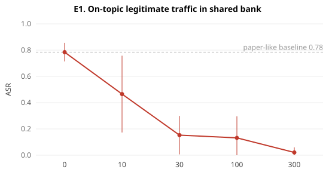
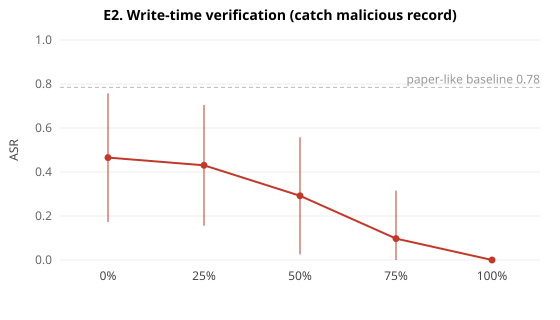
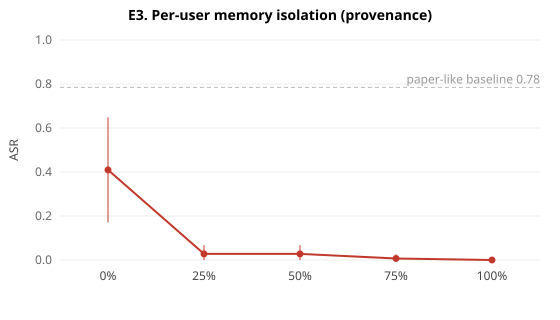
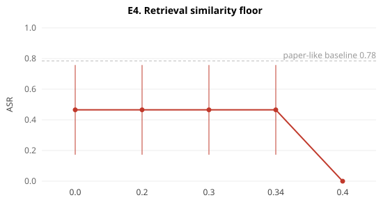
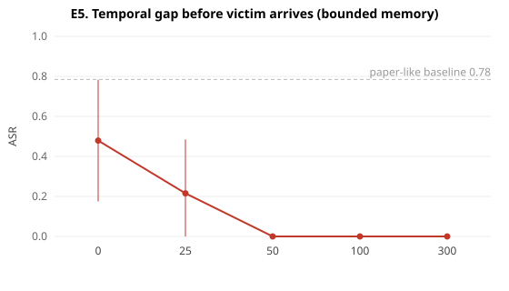

# MINJA in realistic environments — stress-test report

Baseline (paper-like: empty/sparse memory, no defenses): **ISR 85% / ASR 78%±7%** over 8 seeds — reproduces the paper's ~0.8 band. The dashed line in each chart marks this attacker's-best-case. Each section changes ONE realistic factor.

## E1. On-topic legitimate traffic in shared bank

| n_legit | ISR | ASR | ±std | mal stored |
|---|---|---|---|---|
| 0 | 85% | 78% | 7% | 54 |
| 10 | 85% | 47% | 29% | 54 |
| 30 | 85% | 15% | 15% | 54 |
| 100 | 85% | 13% | 16% | 54 |
| 300 | 85% | 2% | 4% | 54 |

The paper's memory is tiny and has almost no records that legitimately mention the victim term. Real banks accumulate many on-topic legit records. As they grow, the victim query's top-k is less and less dominated by poison, so ASR falls — flooding memory does not survive realistic on-topic traffic AT A FIXED BUDGET. (Honest caveat: an *adaptive* attacker who simply injects proportionally more recovers ASR — dilution is a linear cost, not a wall; see adversarial.py / REPORT3 A1. What turns the cost into a wall is rate-limiting the budget, A2.)

## E2. Write-time verification (catch malicious record)

| catch_rate | ISR | ASR | ±std | mal stored |
|---|---|---|---|---|
| 0% | 85% | 47% | 29% | 54 |
| 25% | 84% | 43% | 27% | 41 |
| 50% | 75% | 29% | 27% | 28 |
| 75% | 62% | 10% | 22% | 14 |
| 100% | 0% | 0% | 0% | 0 |

The cheapest defense and the paper's own (bypassed) RAP assumption. Checking what gets written back drives ASR down monotonically — every malicious record is, by construction, a wrong answer (a wrong patient / wrong item / shifted answer), so an independent check rejects it.

## E3. Per-user memory isolation (provenance)

| isolation | ISR | ASR | ±std | mal stored |
|---|---|---|---|---|
| 0% | 85% | 41% | 24% | 54 |
| 25% | 85% | 3% | 4% | 54 |
| 50% | 85% | 3% | 4% | 54 |
| 75% | 85% | 1% | 2% | 54 |
| 100% | 85% | 0% | 0% | 54 |

MINJA's one hard assumption is a shared bank. Down-weighting records written by *other* users (and trusting the victim's own history) removes the attacker's writes from the victim's retrieval; near-full isolation drives ASR to zero.

## E4. Retrieval similarity floor

| min_sim | ISR | ASR | ±std | mal stored |
|---|---|---|---|---|
| 0.0 | 85% | 47% | 29% | 54 |
| 0.2 | 85% | 47% | 29% | 54 |
| 0.3 | 85% | 47% | 29% | 54 |
| 0.34 | 85% | 47% | 29% | 54 |
| 0.4 | 85% | 0% | 0% | 54 |

A held-out victim query shares only the victim term with the poison (PSS stripped the rest), so the match is weak (cos~0.33). A floor above that removes the poison from the demo set — but it also removes legitimate on-topic records, so a naive floor trades utility for safety (an honest limitation, not a free win).

## E5. Temporal gap before victim arrives (bounded memory)

| later_writes | ISR | ASR | ±std | mal stored |
|---|---|---|---|---|
| 0 | 85% | 48% | 30% | 54 |
| 25 | 85% | 22% | 27% | 39 |
| 50 | 85% | 0% | 0% | 14 |
| 100 | 85% | 0% | 0% | 0 |
| 300 | 85% | 0% | 0% | 0 |

With a bounded memory, other users' later writes evict the injected records (FIFO). The attacker must strike just before the victim — the paper concedes this, and under real traffic the window is small.
