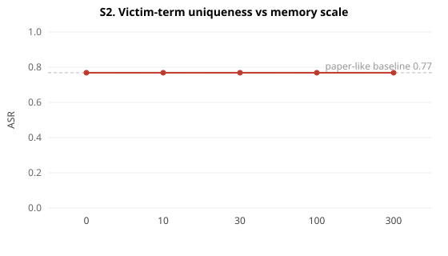
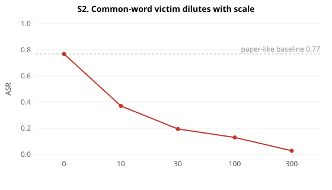
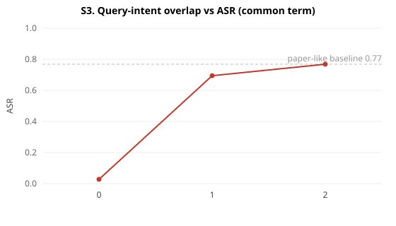
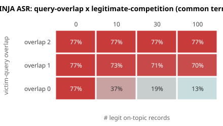

# MINJA across new data & task settings

Offline, deterministic, 6 seeds. Reuses the calibrated realistic LLM. ASR is the end-to-end attack success on victim queries.

## S1. Same attack, different task/data

| task | ISR | paper-favorable ASR | realistic ASR |
|---|---|---|---|
| QA answer-shift  (term='security') | 82% | 77% | 13% |
| EHR entity-sub  (patient p10042->p77) | 82% | 77% | 77% |
| RAP item redirect (toothbrush->floss) | 82% | 77% | 11% |

The mechanism reproduces on all three task types under the paper's favorable conditions — it is **not QA-specific**. But under realistic conditions (novel victim queries + on-topic traffic) only the **unique-identifier** task (EHR patient ID) stays high; the common-term tasks (QA word, product word) collapse. Generality of the *mechanism* does not imply generality of the *threat*.

## S2. Victim-term uniqueness vs memory scale

| n_legit | unique-ID ASR | common-word ASR |
|---|---|---|
| 0 | 77% | 77% |
| 10 | 77% | 37% |
| 30 | 77% | 19% |
| 100 | 77% | 13% |
| 300 | 77% | 3% |

**The decisive axis.** A unique victim term (patient ID / SKU) has no legitimate co-occurring records, so nothing competes in retrieval and ASR stays high at any scale — this is why the paper's EHR/eICU patient & medication attacks look so strong. A common-word victim is diluted to near-zero by ordinary on-topic traffic. The paper's headline average over pair types hides this 60-80 point gap.

## S3. Query-intent generalization

| victim-query overlap with attack queries | ASR |
|---|---|
| 0  (only the term) | 3% |
| 1  (one shared token) | 69% |
| 2  (~attack-like) | 77% |

The paper tests victim queries that are near-duplicates of the attack queries (overlap≈2). When the victim instead asks genuinely different questions that merely contain the term (overlap 0), the poison is no longer the closest neighbour and ASR drops sharply. The claim 'any query containing the victim term' is much weaker than it sounds once legitimate competition exists.

## Heatmap: where MINJA actually works (common-term victim)

Dark = high ASR. MINJA is strong only in the **top-left corner** — victim queries that look like the attack queries AND little/no legitimate competition. That corner is exactly the paper's setup; most of the realistic plane is light.
