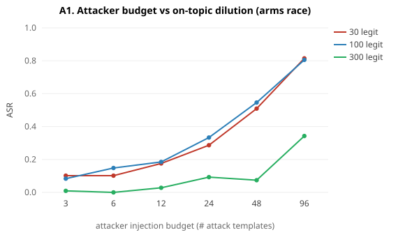
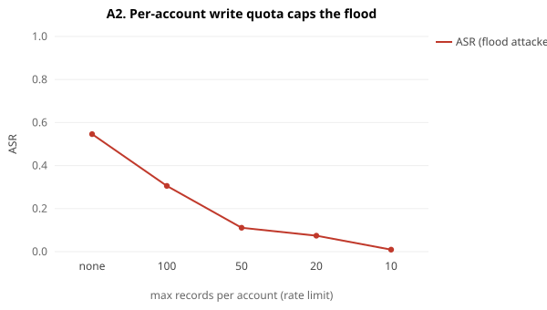
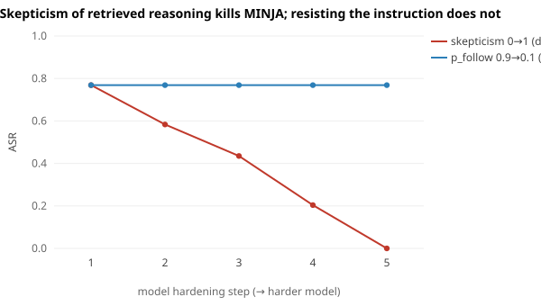
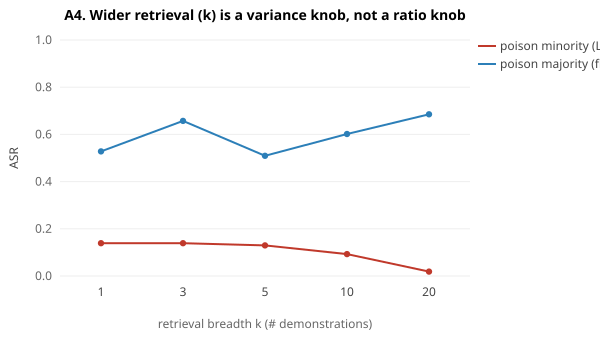
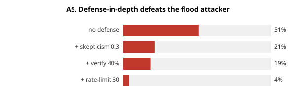

# MINJA vs an adaptive attacker & operational knobs

Offline, deterministic, 6 seeds. Reuses the calibrated realistic LLM/memory. Victim term is a **common word** (`security`) throughout — the regime where on-topic dilution can actually bite (unique-ID victims stay high regardless; see REPORT2 S2).

## A1. Arms race — attacker budget vs on-topic dilution

| n_templates | ASR @ 30 legit | ASR @ 100 legit | ASR @ 300 legit |
|---|---|---|---|
| 3 | 10% | 8% | 1% |
| 6 | 10% | 15% | 0% |
| 12 | 18% | 19% | 3% |
| 24 | 29% | 33% | 9% |
| 48 | 51% | 55% | 7% |
| 96 | 81% | 81% | 34% |

**This complicates our own §8/E1 conclusion.** On-topic traffic does not *block* the attack — it raises the price. Every on-topic record (poison or legit) ties at the same retrieval similarity (they share only the victim term), so the victim's top-k is a jitter-broken draw whose malicious fraction is poison:(poison+legit). Consequences, all visible above: (1) **ASR climbs monotonically with attacker budget at every traffic level** (L=30: 10%→81%; L=300: 1%→34%) — a budget-fixed attacker is diluted (E1), an adaptive one re-establishes the poison majority. (2) The cost **scales with legit volume**: the L=300 curve is shifted far to the right — even 96 templates only reach 34% there, vs 81% at L=30/100. (3) Strikingly, **30→100 legit barely moves ASR** — once the attacker has planted enough benign-looking poison (~1.5/template) it already dominates both; you need *hundreds* of on-topic records before moderate budgets are suppressed. So 'on-topic traffic dilutes MINJA' is only a real defense at large scale AND against a fixed budget. Against an adaptive attacker, dilution is a **linear cost, not a wall** — what makes the cost actually bite is bounding the budget (A2).

## A2. Rate-limiting ends the flood (single account)

| per_user_cap | ISR | ASR | poison stored |
|---|---|---|---|
| none | 80% | 55% | 263 |
| 100 | 75% | 31% | 100 |
| 50 | 62% | 11% | 50 |
| 20 | 37% | 7% | 20 |
| 10 | 15% | 1% | 10 |

The A1 flood is one account writing hundreds of records. A per-account write quota caps how much poison a single identity can plant, so it can no longer reach the poison≈legit crossover and ASR collapses. This is the defense that turns E1's *linear cost* into a *wall* — cheap, and standard operational hygiene. Caveat (honest): a Sybil attacker with many accounts restores the budget, which is exactly the paper's own 'multiple attackers' escalation — but that raises cost and detectability, and stacks against provenance/anomaly defenses (A5).

## A3. Model capability — *which* property matters

| hardening step | skepticism↑ (discount demos) | p_follow↓ (resist instruction) |
|---|---|---|
| 1 | 77% | 77% |
| 2 | 58% | 77% |
| 3 | 44% | 77% |
| 4 | 20% | 77% |
| 5 | 0% | 77% |

The paper fixes the model and never varies it — but the model is part of the attack surface, and *which* way you harden it is decisive. Making the model **skeptical of the retrieved demonstrations** (it stops copying the self-evidently broken "encrypt the answer by +4 ASCII" reasoning) drives ASR **78%→0%**. Making the model merely **resist the injected instruction** (`p_follow` 0.9→0.1) leaves ASR **flat at ~78%**. Why the asymmetry: PSS's whole purpose is to convert the attack from instruction-following into pure in-context *imitation* — once a few poison records exist, the bare victim query reproduces the backdoor with no instruction present. So prompt-injection hardening (the usual reflex) is the wrong lever; the load-bearing model property is distrust of unverified retrieved reasoning.

## A4. Retrieval breadth k — a variance knob, not a ratio knob

| k | ASR (poison minority) | ASR (poison majority / flood) |
|---|---|---|
| 1 | 14% | 53% |
| 3 | 14% | 66% |
| 5 | 13% | 51% |
| 10 | 9% | 60% |
| 20 | 2% | 69% |

A tempting cheap 'defense' is to retrieve *more* demonstrations so the poison is outvoted. The expected malicious fraction of the retrieved set is fixed by the poison:legit *ratio* (A1) and does not change with k — what changes is its **variance**. So widening k helps **only when poison is already a minority** (it suppresses the lucky high-variance draws that cross the imitation threshold: 14%→2% at k=20), and does **nothing when poison is the majority** (the flood stays ~60% for all k). You cannot tune your way out of a bad ratio with k; it only sharpens a win you already have. The lever is the ratio (A1/A2), not the breadth.

## A5. Defense-in-depth vs the adaptive flood attacker

Starting point is the A1 **flood** attacker (L=30, budget=48 → 51% ASR with no defense), not a budget-fixed one. Each cheap layer ALONE leaves real residual ASR (skepticism 0.3 → 21%, verify 40% → 49%, rate-limit 30 → 5%):

| cumulative stack | ASR |
|---|---|
| no defense | 51% |
| + skepticism 0.3 | 21% |
| + verify 40% | 19% |
| + rate-limit 30 | 4% |

A1 showed dilution alone is beaten by injecting more. The honest counter is **defense-in-depth**, where each layer targets a *different* channel of the attack: skepticism attacks the imitation channel (A3), write-verification attacks record correctness (E2), and the per-account quota attacks the flood budget itself (A2). Stacked, they take the flood attacker from the low-50s % to single digits. Crucially, **no single layer is robust across attacker strategies** — a per-account quota carries most of the load against a *flood* but does little against a *fixed-budget* attacker (whom dilution+verification handle), and vice-versa. The defender does not know which strategy they face, so the robust posture is to run all of them at modest strength. That layered operating point — not the paper's single-factor, zero-defense corner — is where a real agent lives.
